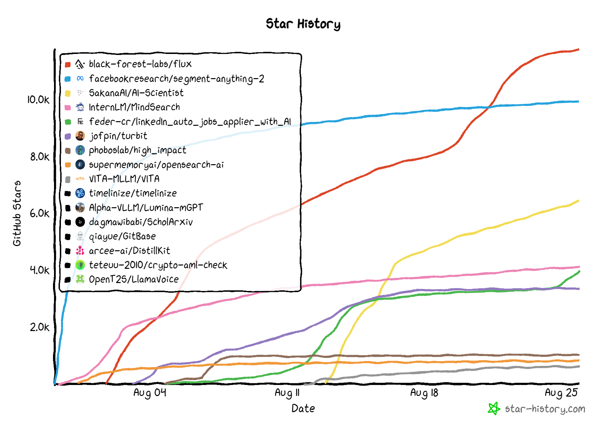

# ***✍️ #InsTech Newsletter***

A Newsletter that is ***Curating Tomorrow’s Tech, Today***. 

It aims to:
- Feature the latest, hidden, and potentially game-changing Tech and AI tools
- Connect investors, founders, devs, and end users with emerging innovators in Tech and AI space

## 📈🐙 Open Source Tools | Featured in #InsTech's 1st & 2nd Editions

### ✨ Star History of Featured OSS Tools:

### 🔔🔁 Keep Supporting #InsTech; It means a lot to us

- ***[1st Edition](https://bit.ly/4dARuR6)***
- ***[2nd Edition](https://www.linkedin.com/feed/update/urn:li:ugcPost:7229952731224920064/)***
- **[Subscribe  #InsTech](https://bit.ly/InsTechSub)**

---